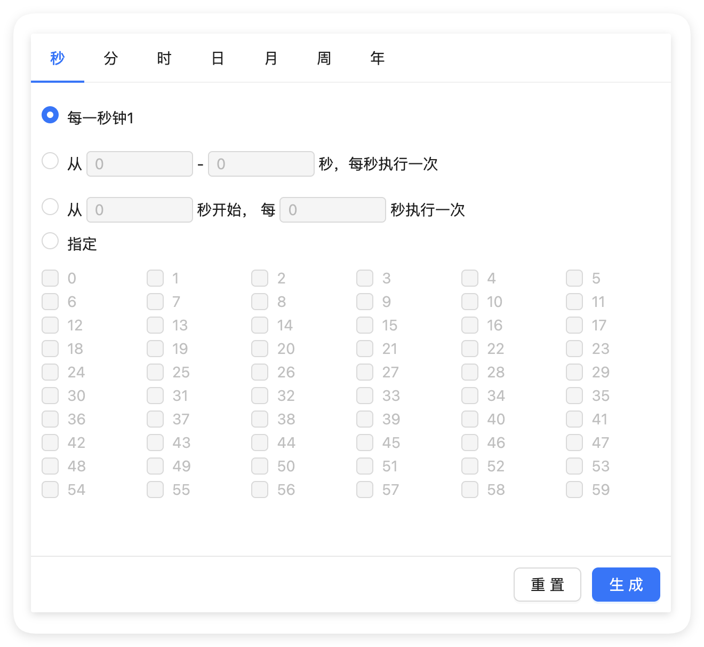

<div align="center">
    <h1>ReactCron</h1>
    <div>基于 React 及 Antd 的 cron 时间表达式生成器</div>
    <br/>
    <div>
        <strong>⚠️ 注意：</strong>原项目已停止维护，本仓库是 fork 后继续维护的版本
    </div>
    <div style="margin-top: 8px; font-size: 14px; color: #666;">
        🔄 已升级支持 Ant Design 5.x 和 React 18
    </div>
    <br/>
    
</div>

---

## 📋 项目背景

原项目 [react-cron-antd](https://github.com/zhengxiangqi/react-cron-antd) 仅支持 Ant Design 4.x，且已停止维护。为了适配最新的技术栈，本仓库进行了以下升级：

- ✅ 升级到 **Ant Design 5.x**（原版仅支持 4.x）
- ✅ 升级到 **React 18**
- ✅ 修复了兼容性问题
- ✅ 持续维护和更新

> 如果你正在使用 Ant Design 5.x 或 React 18，请使用本仓库的 `nebula-cron-antd` 包。

---

## ✨ 特性

- 🎉 全面支持 cron：秒、分、时、日、月、周、年
- 🎉 日及周条件互斥，自动改变响应值
- 🎉 支持反解析 cron 表达式到 UI
- 🎉 可结合此组件与 Antd 的下拉及输入组件封装成下拉输入框
- 🎉 基于 React 18 和 Ant Design 5
- 🎉 完全开源，MIT 许可证

---

## 📦 安装

```bash
npm install nebula-cron-antd
# 或
yarn add nebula-cron-antd
```

---

## 🚀 使用

### 基础用法

```jsx
import React from 'react';
import Cron from 'nebula-cron-antd';

function Page() {
    return <Cron value="* * * * * ? *" onOk={(value) => console.log('cron:', value)} />;
}

export default Page;
```

### 扩展用法

封装一个用于表单组件的 CronInput：

```jsx
import React from 'react';
import { Dropdown, Input } from 'antd';
import Cron from 'nebula-cron-antd';

function CronInput(props) {
    const { value, onChange } = props;

    return (
        <Dropdown
            trigger={['click']}
            placement="bottomLeft"
            overlay={<Cron value={value} onOk={onChange} />}
        >
            <Input.Search value={value} />
        </Dropdown>
    );
}

export default CronInput;
```

---

## 🛠️ 开发指南

### 环境要求

- Node.js >= 16
- npm 或 yarn

### 启动示例项目

如果你想查看组件的实际效果，可以启动示例项目：

```bash
# 1. 在项目根目录安装依赖
npm install
# 或
yarn install

# 2. 编译组件
npm run build
# 或
yarn build

# 3. 进入 demo 目录
cd demo

# 4. 安装 demo 依赖
npm install
# 或
yarn install

# 5. 启动开发服务器
npm run dev
# 或
yarn dev
```

启动后，浏览器会自动打开 `http://localhost:3000`，你可以在页面上看到组件的实际效果。

> **注意**：每次修改组件源码后，需要重新运行 `npm run build` 来编译组件，然后刷新浏览器查看效果。

### 构建项目

```bash
# 在项目根目录执行
npm run build
# 或
yarn build
```

---

## 🤝 参与贡献

我们欢迎所有形式的贡献！如果你有兴趣参与项目开发，请按照以下步骤：

### 贡献流程

1. **Fork 本项目**
   - 点击页面右上角的 Fork 按钮

2. **克隆你的 Fork**
   ```bash
   git clone https://github.com/你的用户名/react-cron-antd.git
   cd react-cron-antd
   ```

3. **创建特性分支**
   ```bash
   git checkout -b feature/你的特性名称
   ```

4. **进行开发**
   - 启动示例项目查看效果
   - 修改代码
   - 确保代码风格一致

5. **提交更改**
   ```bash
   git add .
   git commit -m "feat: 添加你的功能描述"
   ```

6. **推送到你的 Fork**
   ```bash
   git push origin feature/你的特性名称
   ```

7. **创建 Pull Request**
   - 在 GitHub 上创建 PR
   - 详细描述你的更改

### 贡献类型

- 🐛 修复 Bug
- ✨ 添加新功能
- 📝 改进文档
- 🎨 优化代码结构
- ⚡ 性能优化
- ✅ 添加测试

### 代码规范

- 遵循现有的代码风格
- 添加必要的注释
- 确保代码通过构建
- 更新相关文档

---

## 📝 更新日志

查看详细的更新日志：[CHANGELOG.md](./CHANGELOG.md)

---

## 📄 许可证

本项目采用 MIT 许可证 - 详见 [LICENSE](./LICENSE) 文件

```
Copyright (c) 2019-present zhengxiangqi
Copyright (c) 2025-present kushu001
```

---

## 🙏 致谢

感谢原作者 [zhengxiangqi](https://github.com/zhengxiangqi) 创建了这个优秀的项目。

---

## 📮 联系方式

如果你有任何问题或建议，欢迎：

- 📌 提交 Issue
- 🔀 发起 Pull Request
- 💬 通过其他方式联系项目维护者

---

<div align="center">
  如果这个项目对你有帮助，请给个 ⭐️ Star 支持一下！
</div>
